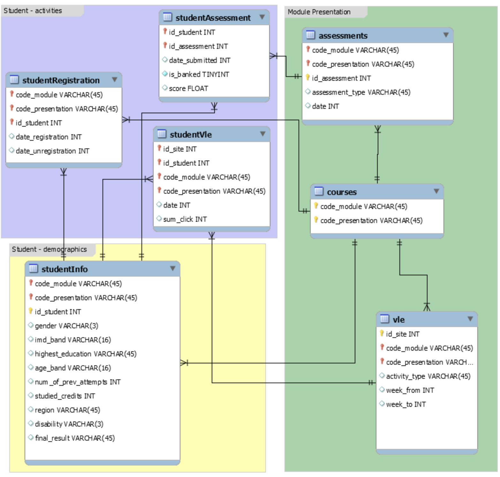

# ML_Coursework

For the ML sub-module in the second year of my degree, we were tasked to predict final year grades from the Open University Learning Analytics Dataset (OULAD).

This dataset schema looks like:

I explored an initial wide variety of models such as regression models, SVMs & forests. We had the flexibility to frame the problem as either a classification or regression problem.
After this, I performed hyperparameter tuning on my best two models: random forest classifier and a logistic regression model. These achieved a 2-class accuracy of 0.96 and 0.92 respectively. 

For the full information on the project, please read my report: [here](./tex/report.pdf)
